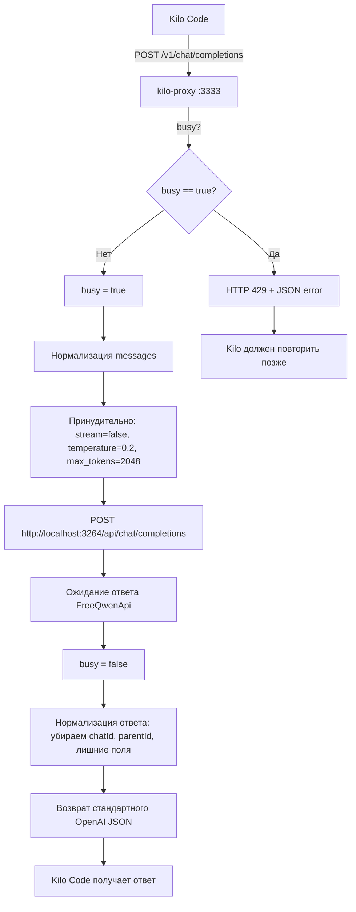

# Kilo Code ↔ FreeQwenApi Compatibility Proxy — План реализации

> **Для agentic workers:** REQUIRED SUB-SKILL: Use superpowers:subagent-driven-development (recommended) or superpowers:executing-plans to implement this plan task-by-task. Steps use checkbox (`- [ ]`) syntax for tracking.

**Goal:** Создать локальный compatibility proxy между Kilo Code и FreeQwenApi, который предотвращает параллельные запросы, нормализует запросы/ответы и обеспечивает стабильную работу Kilo через FreeQwenApi.

**Architecture:** Express-сервер на порту 3333 с двумя эндпоинтами (`GET /v1/models`, `POST /v1/chat/completions`), который работает как однопоточный прокси между Kilo Code и FreeQwenApi (порт 3264). Глобальный `busy`-флаг предотвращает параллельные запросы к Qwen (HTTP 429 при конфликте). Запросы нормализуются: `stream=false`, фиксированная модель, очистка лишних полей.

**Tech Stack:** Node.js, Express, node-fetch (встроенный в Node 18+)

**Рабочая папка:** `D:\Codex+Kilocode\FreeQwenApi\kilo-proxy`

---

## Файловая структура

```
D:\Codex+Kilocode\FreeQwenApi\kilo-proxy\
├── package.json          # Зависимости: express
├── proxy.js              # Основной код прокси
├── README.md             # Инструкции
└── node_modules/         # (после npm install)
```

Каждый файл отвечает за:
- `package.json` — метаданные проекта и единственная зависимость `express`
- `proxy.js` — весь код: сервер, эндпоинты, busy-флаг, нормализация, логирование
- `README.md` — документация для пользователя

---

## Диаграмма потока запросов



---

## Task 1: Создание проекта и package.json

**Files:**
- Create: `D:\Codex+Kilocode\FreeQwenApi\kilo-proxy\package.json`

- [ ] **Step 1: Создать папку kilo-proxy**

```powershell
New-Item -ItemType Directory -Path "D:\Codex+Kilocode\FreeQwenApi\kilo-proxy" -Force
```

- [ ] **Step 2: Создать package.json**

```json
{
  "name": "kilo-freeqwen-proxy",
  "version": "1.0.0",
  "description": "Локальный compatibility proxy между Kilo Code и FreeQwenApi. Предотвращает параллельные запросы, нормализует OpenAI-совместимые запросы/ответы.",
  "main": "proxy.js",
  "type": "module",
  "scripts": {
    "start": "node proxy.js"
  },
  "dependencies": {
    "express": "^4.21.0"
  },
  "license": "MIT"
}
```

- [ ] **Step 3: Установить зависимости**

```powershell
cd D:\Codex+Kilocode\FreeQwenApi\kilo-proxy
npm install
```

Ожидаемый результат: папка `node_modules` создана, `npm install` завершился без ошибок.

---

## Task 2: Реализация GET /v1/models

**Files:**
- Create: `D:\Codex+Kilocode\FreeQwenApi\kilo-proxy\proxy.js` (частично)

- [ ] **Step 1: Создать базовый каркас proxy.js с эндпоинтом models**

```javascript
import express from 'express';

const app = express();
const PORT = process.env.PROXY_PORT || 3333;
const FREEQWEN_URL = process.env.FREEQWEN_URL || 'http://localhost:3264';

app.use(express.json({ limit: '50mb' }));

// ─── GET /v1/models ────────────────────────────────────────────────
app.get('/v1/models', (_req, res) => {
  console.log('[proxy] ← GET /v1/models');
  res.json({
    object: 'list',
    data: [
      {
        id: 'qwen3.7-max',
        object: 'model',
        created: 0,
        owned_by: 'freeqwen'
      }
    ]
  });
  console.log('[proxy] → 200 OK (models list)');
});

// Пока заглушка для chat completions (будет заменена в Task 3)
app.post('/v1/chat/completions', (_req, res) => {
  res.status(501).json({ error: 'not implemented yet' });
});

// ─── 404 для всего остального ─────────────────────────────────────
app.use((_req, res) => {
  res.status(404).json({ error: 'Not found' });
});

app.listen(PORT, () => {
  console.log(`[proxy] Kilo-FreeQwen proxy запущен на http://localhost:${PORT}/v1`);
  console.log(`[proxy] Upstream FreeQwenApi: ${FREEQWEN_URL}/api/chat/completions`);
  console.log(`[proxy] Модель по умолчанию: qwen3.7-max`);
  console.log(`[proxy] Защита от параллельных запросов: busy-flag (429)`);
});
```

- [ ] **Step 2: Проверить models через curl**

```powershell
curl.exe -i http://localhost:3333/v1/models
```

Ожидаемый ответ:
```
HTTP/1.1 200 OK
{"object":"list","data":[{"id":"qwen3.7-max","object":"model","created":0,"owned_by":"freeqwen"}]}
```

---

## Task 3: Реализация POST /v1/chat/completions

**Files:**
- Modify: `D:\Codex+Kilocode\FreeQwenApi\kilo-proxy\proxy.js` (замена заглушки)

- [ ] **Step 1: Полный код proxy.js**

```javascript
import express from 'express';

const app = express();
const PORT = process.env.PROXY_PORT || 3333;
const FREEQWEN_URL = process.env.FREEQWEN_URL || 'http://localhost:3264';
const DEFAULT_MODEL = process.env.DEFAULT_MODEL || 'qwen3.7-max';

app.use(express.json({ limit: '50mb' }));

// ─── Глобальный busy-флаг для защиты от параллельных запросов ──────
let busy = false;

// ─── Helpers ────────────────────────────────────────────────────────

/**
 * Нормализует контент сообщения к строке.
 * Если content — не строка (например, массив для vision), сериализуем в JSON.
 */
function normalizeContent(content) {
  if (content === null || content === undefined) return '';
  if (typeof content === 'string') return content;
  return JSON.stringify(content);
}

/**
 * Нормализует массив messages:
 * - Оставляет только допустимые роли: system, user, assistant
 * - Приводит content к строке
 */
function normalizeMessages(messages) {
  if (!Array.isArray(messages)) return [];
  const allowedRoles = new Set(['system', 'user', 'assistant']);
  return messages
    .filter(msg => msg && allowedRoles.has(msg.role))
    .map(msg => ({
      role: msg.role,
      content: normalizeContent(msg.content)
    }));
}

/**
 * Строит безопасное тело запроса для FreeQwenApi.
 * Убирает все поля, которые могут вызвать нестандартное поведение.
 */
function buildUpstreamBody(reqBody) {
  const messages = normalizeMessages(reqBody.messages || []);
  return {
    model: DEFAULT_MODEL,
    messages,
    stream: false,
    temperature: 0.2,
    max_tokens: 2048
  };
}

/**
 * Нормализует ответ от FreeQwenApi к стандартному OpenAI-формату.
 * Убирает chatId, parentId, prompt_tokens_details, cached_tokens и т.д.
 */
function normalizeResponse(upstreamBody) {
  const choice = (upstreamBody.choices && upstreamBody.choices[0]) || {};
  const message = choice.message || {};

  return {
    id: upstreamBody.id || ('chatcmpl-' + Date.now()),
    object: 'chat.completion',
    created: Math.floor(Date.now() / 1000),
    model: DEFAULT_MODEL,
    choices: [
      {
        index: 0,
        message: {
          role: message.role || 'assistant',
          content: normalizeContent(message.content)
        },
        finish_reason: choice.finish_reason || 'stop'
      }
    ],
    usage: {
      prompt_tokens: (upstreamBody.usage && upstreamBody.usage.prompt_tokens) || 0,
      completion_tokens: (upstreamBody.usage && upstreamBody.usage.completion_tokens) || 0,
      total_tokens: (upstreamBody.usage && upstreamBody.usage.total_tokens) || 0
    }
  };
}

// ─── GET /v1/models ────────────────────────────────────────────────
app.get('/v1/models', (_req, res) => {
  console.log('[proxy] ← GET /v1/models');
  res.json({
    object: 'list',
    data: [
      {
        id: DEFAULT_MODEL,
        object: 'model',
        created: 0,
        owned_by: 'freeqwen'
      }
    ]
  });
  console.log('[proxy] → 200 OK (models list)');
});

// ─── POST /v1/chat/completions ─────────────────────────────────────
app.post('/v1/chat/completions', async (req, res) => {
  const messages = req.body.messages || [];
  const roles = messages.map(m => m.role).join(', ');

  console.log('[proxy] ← POST /v1/chat/completions');
  console.log(`[proxy]   messages: ${messages.length} шт., роли: [${roles}]`);
  console.log(`[proxy]   model (запрошен): ${req.body.model || '(не указан)'}`);
  console.log(`[proxy]   stream (запрошен): ${req.body.stream || false}`);

  // ── Проверка busy-флага ──────────────────────────────────────────
  if (busy) {
    console.log('[proxy] ⛔ BUSY — отклоняем параллельный запрос (429)');
    return res.status(429).json({
      error: {
        message: 'FreeQwen proxy is busy. Kilo sent a parallel request; retry later.',
        type: 'rate_limit'
      }
    });
  }

  busy = true;
  console.log('[proxy]   busy = true (начало обработки)');

  try {
    const upstreamBody = buildUpstreamBody(req.body);

    console.log(`[proxy] → POST ${FREEQWEN_URL}/api/chat/completions`);
    console.log(`[proxy]   model: ${upstreamBody.model}, stream: ${upstreamBody.stream}, ` +
                `temperature: ${upstreamBody.temperature}, max_tokens: ${upstreamBody.max_tokens}`);
    console.log(`[proxy]   messages после нормализации: ${upstreamBody.messages.length} шт.`);

    const upstreamRes = await fetch(`${FREEQWEN_URL}/api/chat/completions`, {
      method: 'POST',
      headers: { 'Content-Type': 'application/json' },
      body: JSON.stringify(upstreamBody)
    });

    console.log(`[proxy] ← FreeQwenApi ответил HTTP ${upstreamRes.status}`);

    if (!upstreamRes.ok) {
      const errorText = await upstreamRes.text();
      console.log(`[proxy]   тело ошибки: ${errorText.substring(0, 500)}`);
      busy = false;
      return res.status(upstreamRes.status).json({
        error: {
          message: `FreeQwenApi вернул ошибку HTTP ${upstreamRes.status}`,
          type: 'upstream_error',
          details: errorText.substring(0, 300)
        }
      });
    }

    const upstreamJson = await upstreamRes.json();
    const normalized = normalizeResponse(upstreamJson);

    const contentLen = normalized.choices[0]?.message?.content?.length || 0;
    console.log(`[proxy] → 200 OK (content length: ${contentLen} символов)`);
    console.log(`[proxy]   content preview: "${normalized.choices[0]?.message?.content?.substring(0, 120)}"`);

    res.json(normalized);
  } catch (err) {
    console.log(`[proxy] ⛔ Ошибка: ${err.message}`);
    busy = false;
    res.status(502).json({
      error: {
        message: `Proxy error: ${err.message}`,
        type: 'proxy_error'
      }
    });
  } finally {
    busy = false;
    console.log('[proxy]   busy = false (конец обработки)');
  }
});

// ─── 404 для всего остального ─────────────────────────────────────
app.use((_req, res) => {
  res.status(404).json({ error: 'Not found' });
});

// ─── Запуск сервера ────────────────────────────────────────────────
app.listen(PORT, () => {
  console.log('');
  console.log('═══════════════════════════════════════════════════════════');
  console.log(`  Kilo-FreeQwen Compatibility Proxy`);
  console.log(`  Адрес:  http://localhost:${PORT}/v1`);
  console.log(`  Models: http://localhost:${PORT}/v1/models`);
  console.log(`  Chat:   http://localhost:${PORT}/v1/chat/completions`);
  console.log(`  Upstream: ${FREEQWEN_URL}/api/chat/completions`);
  console.log(`  Модель: ${DEFAULT_MODEL}`);
  console.log(`  Busy-защита: включена (HTTP 429 при параллельном запросе)`);
  console.log('═══════════════════════════════════════════════════════════');
  console.log('');
});
```

- [ ] **Step 2: Проверить chat completions через curl**

Создать тестовый JSON-файл:

```powershell
@'
{
  "model": "qwen3.7-max",
  "messages": [
    {
      "role": "user",
      "content": "Ответь строго одним словом: работает"
    }
  ],
  "stream": false
}
'@ | Set-Content -Encoding UTF8 "D:\Codex+Kilocode\FreeQwenApi\kilo-proxy\kilo-proxy-test.json"
```

Отправить запрос:

```powershell
curl.exe -i http://localhost:3333/v1/chat/completions `
  -H "Content-Type: application/json" `
  --data-binary "@D:\Codex+Kilocode\FreeQwenApi\kilo-proxy\kilo-proxy-test.json"
```

Ожидаемый результат:
- HTTP 200
- `choices[0].message.content` содержит ответ модели (не пустой)
- В логах proxy видно ровно один upstream-запрос к FreeQwenApi
- В логах FreeQwenApi видно только один запрос (не два)

- [ ] **Step 3: Проверить защиту от параллельных запросов**

Быстро отправить два запроса подряд (второй должен получить 429):

```powershell
curl.exe -i http://localhost:3333/v1/chat/completions `
  -H "Content-Type: application/json" `
  --data-binary "@D:\Codex+Kilocode\FreeQwenApi\kilo-proxy\kilo-proxy-test.json"
```

Если отправить второй запрос пока первый ещё обрабатывается:
- HTTP 429
- `{"error":{"message":"FreeQwen proxy is busy...","type":"rate_limit"}}`

---

## Task 4: Написание README.md

**Files:**
- Create: `D:\Codex+Kilocode\FreeQwenApi\kilo-proxy\README.md`

- [ ] **Step 1: Создать README.md**

```markdown
# Kilo Code ↔ FreeQwenApi Compatibility Proxy

Локальный compatibility proxy между Kilo Code и FreeQwenApi.

**Проблема:** Kilo Code отправляет два параллельных запроса к FreeQwenApi почти одновременно. Из-за этого FreeQwenApi создаёт два Qwen-чата, один из которых ловит anti-bot challenge. Результат — Kilo зависает.

**Решение:** Proxy принимает запросы от Kilo, нормализует их, отправляет в FreeQwenApi строго по одному, и возвращает стандартный OpenAI-совместимый JSON.

## Возможности

- `GET /v1/models` — список моделей (OpenAI-совместимый)
- `POST /v1/chat/completions` — чат-запросы
- Принудительно: `stream=false`, `temperature=0.2`, `max_tokens=2048`
- Защита от параллельных запросов: HTTP 429 если proxy занят
- Нормализация ответа: убирает `chatId`, `parentId`, `prompt_tokens_details` и другие нестандартные поля

## Как запустить

### 1. Запустить FreeQwenApi

```powershell
cd D:\Codex+Kilocode\FreeQwenApi
node index.js
```

Убедиться, что FreeQwenApi работает на `http://localhost:3264`:

```powershell
curl.exe http://localhost:3264/api/
# → {"ok":true,"service":"FreeQwenApi","baseUrl":"/api"}
```

### 2. Установить зависимости proxy

```powershell
cd D:\Codex+Kilocode\FreeQwenApi\kilo-proxy
npm install
```

### 3. Запустить proxy

```powershell
node proxy.js
```

Proxy запускается на `http://localhost:3333/v1`.

## Проверка через curl

### Проверить models

```powershell
curl.exe -i http://localhost:3333/v1/models
```

Ожидаемый ответ:

```json
{
  "object": "list",
  "data": [
    {
      "id": "qwen3.7-max",
      "object": "model",
      "created": 0,
      "owned_by": "freeqwen"
    }
  ]
}
```

### Проверить chat completions

Создать тестовый файл:

```powershell
@'
{
  "model": "qwen3.7-max",
  "messages": [
    {
      "role": "user",
      "content": "Ответь строго одним словом: работает"
    }
  ],
  "stream": false
}
'@ | Set-Content -Encoding UTF8 .\kilo-proxy-test.json
```

Отправить запрос:

```powershell
curl.exe -i http://localhost:3333/v1/chat/completions `
  -H "Content-Type: application/json" `
  --data-binary "@kilo-proxy-test.json"
```

Ожидаемый результат:

- HTTP 200
- `choices[0].message.content` содержит ответ модели (например, "Работает")
- В логах proxy и FreeQwenApi — ровно один upstream-запрос

## Настройки Kilo Code

В настройках Kilo Code указать:

| Параметр | Значение |
|---|---|
| Provider | OpenAI Compatible |
| Base URL | `http://localhost:3333/v1` |
| API Key | `dummy-key` |
| Model | `qwen3.7-max` |
| Streaming | Off |
| Tools / tool calling | Off (на первом тесте) |
| Reasoning / thinking | Off (на первом тесте) |

## Диагностика

Proxy выводит в консоль:

- Когда пришёл запрос от Kilo
- Какие роли messages пришли
- Был ли запрос отклонён как parallel/busy
- Какой HTTP статус вернул FreeQwenApi
- Длину ответа и превью content

Пример логов при успешном запросе:

```
[proxy] ← POST /v1/chat/completions
[proxy]   messages: 2 шт., роли: [system, user]
[proxy]   model (запрошен): qwen3.7-max
[proxy]   stream (запрошен): false
[proxy]   busy = true (начало обработки)
[proxy] → POST http://localhost:3264/api/chat/completions
[proxy]   model: qwen3.7-max, stream: false, temperature: 0.2, max_tokens: 2048
[proxy]   messages после нормализации: 2 шт.
[proxy] ← FreeQwenApi ответил HTTP 200
[proxy] → 200 OK (content length: 8 символов)
[proxy]   content preview: "Работает"
[proxy]   busy = false (конец обработки)
```

## Возможный второй этап (не сейчас)

- Заменить 429 busy на очередь запросов
- Добавить env-переменные: `FREEQWEN_URL`, `PROXY_PORT`, `DEFAULT_MODEL`
- Добавить `qwen3-coder-plus` как опциональную модель
- Добавить логирование в файл
```

---

## Task 5: Финальная проверка

- [ ] **Step 1: Проверить полный цикл**

1. Убедиться, что FreeQwenApi запущен на `http://localhost:3264`
2. Запустить proxy: `node D:\Codex+Kilocode\FreeQwenApi\kilo-proxy\proxy.js`
3. `curl http://localhost:3333/v1/models` → 200 OK
4. `curl POST http://localhost:3333/v1/chat/completions` с тестовым JSON → 200 OK, content не пустой
5. Проверить логи FreeQwenApi: только один upstream-запрос на один curl-запрос
6. Настроить Kilo Code на `http://localhost:3333/v1` и проверить простой запрос "Ответь одним словом: работает"

**Критерий готовности:**
- [ ] Прямой запрос к `http://localhost:3333/v1/chat/completions` возвращает валидный OpenAI-compatible JSON
- [ ] Kilo Code, настроенный на `http://localhost:3333/v1`, получает и показывает ответ модели
- [ ] В логах FreeQwenApi больше не возникает два одновременных upstream-запроса на один тест Kilo, либо второй запрос аккуратно отсекается proxy через 429

---

## Self-Review

### 1. Spec coverage
- ✅ Создание папки kilo-proxy → Task 1
- ✅ package.json с express → Task 1
- ✅ GET /v1/models → Task 2
- ✅ POST /v1/chat/completions → Task 3
- ✅ Защита от параллельных запросов (busy flag, 429) → Task 3
- ✅ Нормализация ответа (убрать chatId, parentId, лишние поля) → Task 3
- ✅ console.log диагностика → Task 3
- ✅ README.md → Task 4
- ✅ Настройки Kilo Code в README → Task 4
- ✅ curl-тесты в README → Task 4
- ✅ Финальная проверка → Task 5

### 2. Placeholder scan
- ✅ Нет TBD/TODO
- ✅ Нет "implement later"
- ✅ Весь код приведён полностью
- ✅ Все команды конкретные

### 3. Type consistency
- ✅ Переменные `busy`, `PORT`, `FREEQWEN_URL`, `DEFAULT_MODEL` используются согласованно
- ✅ `normalizeMessages` → `buildUpstreamBody` → `fetch` → `normalizeResponse`: цепочка без разрывов
